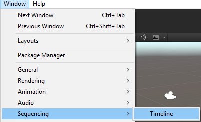
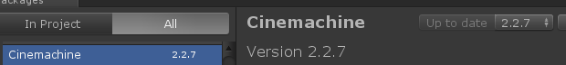

# Week 24 - Timeline and Cinemachine

## Timeline

[**Timeline**](https://unity3d.com/learn/tutorials/topics/animation/using-timeline-getting-started) is a powerful tool that enables simple, intuitive creation of directed animations. It provides tools to create cutscenes using tracks of animations, sounds, cameras and effects using a simple interface.

To access Timeline in your Unity project, go to **Window > Sequencing > Timeline**.

## Cinemachine

[**Cinemachine**](https://unity3d.com/learn/tutorials/topics/animation/using-cinemachine-getting-started) is a set of camera tools that provide an easy way to set up multiple camera positions, blend between them, track objects, and many other things.

Cinemachine is an official Unity package and can be enabled by going to **Window > Package Manager**. From there, you can install Cinemachine in the package list.

